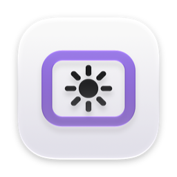
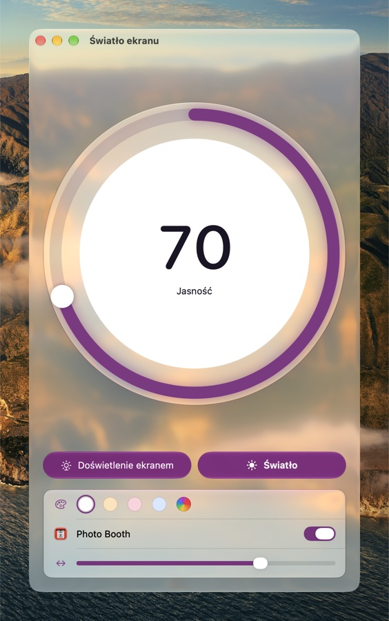
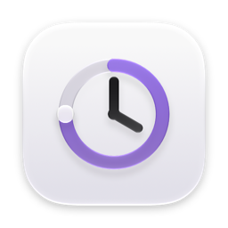
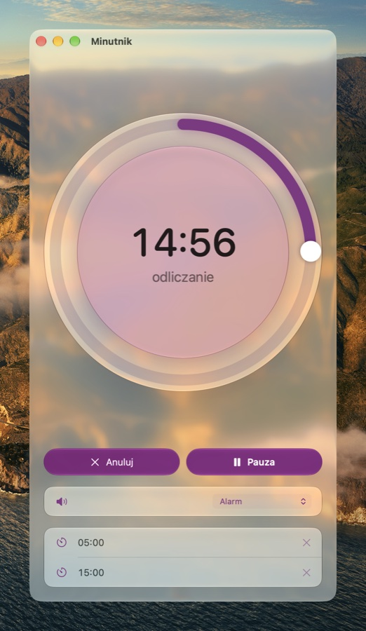

# Atypical Maker Mac Apps

Small Mac apps by [EnderNoch](https://github.com/EnderNoch) (Atypical Maker). Each one does one
thing, looks like part of macOS 26/27, and takes from the system everything the system already
offers: language, light and dark appearance, accent color, the Liquid Glass slider and the icon
style.

*[Po polsku niżej.](#po-polsku)*

| | App | What it does | |
| :---: | --- | --- | :---: |
|  | **[Screen Light](https://github.com/EnderNoch/Screen-Light)** Światło ekranu | A fill light made of your screen, for video calls and photos: the whole screen glows in the chosen color, or just a band around the edges (like the system's Edge Light), and it turns on by itself with Photo Booth. [Download](https://github.com/EnderNoch/Screen-Light/raw/main/Screen-Light.zip) |  |
|  | **[Timer](https://github.com/EnderNoch/Timer)** Minutnik | A timer for the menu bar and a window: a dial like a kitchen timer, time typed right in the ring, the system's alert sounds as in Clock, and presets. [Download](https://github.com/EnderNoch/Timer/raw/main/Timer.zip) |  |

## Installing

Each app is a zip file in its own repository: open it and drag the app into the Applications
folder. The apps aren't notarized, so the first launch has to be allowed once: System Settings →
Privacy & Security → **Open Anyway**.

They need macOS 26 or later on a Mac with Apple silicon.

## License

All rights reserved. The apps may be downloaded and used; the code may not be copied,
redistributed or modified — see each app's LICENSE.

---

## Po polsku

Małe aplikacje na Maca od EnderNoch (Atypical Maker). Każda robi jedną rzecz, wygląda jak część
macOS 26/27 i bierze z systemu wszystko, co system już daje: język, jasny i ciemny wygląd, kolor
akcentu, suwak Liquid Glass i styl ikon.

- **[Światło ekranu](https://github.com/EnderNoch/Screen-Light)** — lampa doświetlająca z ekranu
  do rozmów wideo i zdjęć: cały ekran świeci wybranym kolorem albo tylko ramka wokół krawędzi
  (jak systemowe Doświetlenie ekranem); sama włącza się przy Photo Booth.
  [Pobierz](https://github.com/EnderNoch/Screen-Light/raw/main/Screen-Light.zip)
- **[Minutnik](https://github.com/EnderNoch/Timer)** — timer na pasek menu i okno: tarcza jak minutnik
  kuchenny, czas wpisywany w kole, dzwonki systemu jak w Zegarze, presety.
  [Pobierz](https://github.com/EnderNoch/Timer/raw/main/Timer.zip)

Instalacja: otwórz plik zip z repozytorium aplikacji i przeciągnij aplikację do folderu Aplikacje.
Przy pierwszym uruchomieniu trzeba ją raz dopuścić: Ustawienia systemowe → Prywatność i ochrona →
**Otwórz mimo to**. Wymagają macOS 26 lub nowszego na Macu z procesorem Apple.

Licencja: wszelkie prawa zastrzeżone. Aplikacje wolno pobrać i używać; kodu nie wolno kopiować,
rozpowszechniać ani zmieniać — szczegóły w pliku LICENSE każdej aplikacji.
